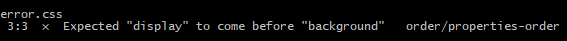

# <center>css-properties-sort</center>

[](https://www.npmjs.org/package/css-properties-sorting)
[](https://www.npmjs.org/package/css-properties-sorting)
[](https://travis-ci.org/cahamilton/css-properties-sorting)

## Installation

First, You should have studied [stylelint](https://github.com/stylelint/stylelint)

```javascript
npm install css-properties-sorting
```

## Example

in .stylelintrc:

```javascript
{
	"plugins": [
		"stylelint-order"
	],
	"extends": "css-properties-sorting"
}
```


**you can use it with webpack or others** 

## Sorting rules

1. display & flow

2. dosition

3. dimension

4. margin/padding/border/outline

5. type graphic style

6. background

7. opacity/cursor/generated/content

8. transition

[Detailed rules（详细规则）](https://github.com/Iwouldliketobeapig/css-properties-sorting/blob/master/index.js)